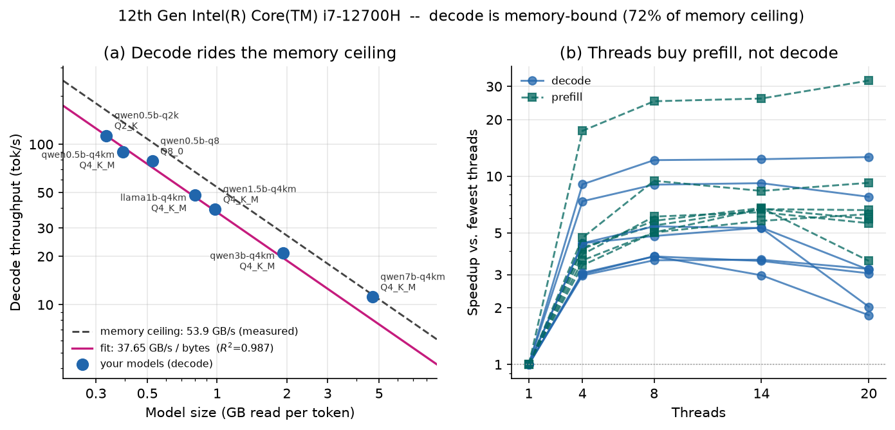

# llama-roofline

**Is your llama.cpp setup memory-bandwidth-bound? Find out in one command.**

[](https://github.com/manunicholasjacob/llama-roofline/actions/workflows/ci.yml)
[](LICENSE)

When a local LLM generates text one token at a time, it has to read **every weight in the
model, from memory, for every single token**. Nothing is reused. That makes token
generation a memory-bandwidth problem, not a compute problem, and it means your tokens per
second are governed by a single equation:

```
decode tok/s  =  BW_eff / model_bytes
```

`llama-roofline` measures both sides of that equation on your machine and tells you where
you sit. It measures your actual sustainable memory bandwidth, benchmarks your own GGUF
models through `llama-bench`, fits the roofline, and prints a report card in English.



Seven models from 0.5B to 7B on one laptop. Decode throughput follows
`37.65 GB/s / model_bytes` with an R² of 0.987, at 65% to 97% of the machine's measured
memory ceiling. Prefill keeps scaling with threads; decode does not.

## Quickstart

You need a working llama.cpp build (specifically `llama-bench`) and at least two GGUF
models, ideally of different sizes or quantizations.

```bash
pip install git+https://github.com/manunicholasjacob/llama-roofline
llama-roofline run --models ~/models/*.gguf
```

That is the whole thing. It finds `llama-bench` on your `PATH` or in the usual build
locations, measures your memory ceiling, sweeps thread counts, and writes the report.

Here is real output, from the machine in the figure above:

```
========================================================================
  llama-roofline v0.1.0  --  report card
========================================================================
  Machine   : 12th Gen Intel(R) Core(TM) i7-12700H
              20 logical / 14 physical cores, 34.0 GB RAM, Windows AMD64
  Memory    : 53.9 GB/s sustained read (measured: dot kernel, 10 threads, 512 MB set)
  llama.cpp : build 10154 (0e4a03622), backends: CPU

  IS YOUR DECODE MEMORY-BOUND?
------------------------------------------------------------------------
  YES -- your decode is memory-bandwidth-bound.

  Token generation is running at 72% of the memory bandwidth this machine
  can actually sustain. The CPU spends most of each token waiting for
  weights to arrive from RAM, not computing.

  THE ROOFLINE
------------------------------------------------------------------------
    decode tok/s  =  37.65 GB/s  /  model bytes
    fitted across 7 models, R^2 = 0.9874
    that effective bandwidth is 70% of your 53.9 GB/s ceiling
    A fit this tight means one number -- bytes -- predicts your
    generation speed. You can size a model for a target tok/s.

  WHAT TO DO ABOUT IT
------------------------------------------------------------------------
  * Model size is your throughput dial. Halving the bytes you load roughly
    doubles tok/s: a smaller model or a lower quant buys speed almost
    exactly in proportion to the bytes it removes.
  * Measured on your models: qwen0.5b-q2k is 14.06x smaller than
    qwen7b-q4km and decodes 10.15x faster. Bytes in, tokens out.
  * Best decode thread count: 8. Past that, extra threads add contention,
    not throughput: decode is waiting on memory, and more waiters do not
    make the memory faster.
  * Using every thread cost up to 63% of decode throughput versus the best
    setting. Set -t explicitly; do not let it default.
  * Prefill is different: it scaled 6.7x with threads (median across your
    models). Prompt processing is compute-bound, so long-prompt workloads
    DO want all your cores even though generation does not.

  YOUR MODELS
------------------------------------------------------------------------
  model                     quant         size    decode   prefill  thr    GB/s  %ceil
  ------------------------------------------------------------------------------------
  qwen0.5b-q2k              Q2_K        333 MB    113.3t      517t    8    37.7    70%
  qwen0.5b-q4km             Q4_K_M      392 MB     89.3t      351t    8    35.0    65%
  qwen0.5b-q8               Q8_0        525 MB     78.6t      294t   14    41.3    76%
  llama1b-q4km              Q4_K_M      800 MB     48.2t      245t   14    38.6    72%
  qwen1.5b-q4km             Q4_K_M      980 MB     39.3t      179t   14    38.5    71%
  qwen3b-q4km               Q4_K_M     1.92 GB     21.0t       87t    8    40.3    75%
  qwen7b-q4km               Q4_K_M     4.68 GB     11.2t       42t   20    52.2    97%
```

The report also prints a CAVEATS section, which is trimmed here but not optional. See
[the full report](examples/x86-i7-12700H/report.txt).

Note the 63% line. Setting `-t 20` on a 20-thread machine, which looks free, cost more
than half the decode throughput on a 0.5B model versus `-t 8`.

## What it tells you that a benchmark does not

`llama-bench` already tells you your tokens per second. This tells you **why that number
is what it is, and which knob actually moves it**:

- **Are you at the wall?** If decode is at 85% of your memory ceiling, a faster CPU will
  do nothing for you. If it is at 30%, something else is wrong and the report says what to
  check.
- **How much will a smaller quant buy?** Not a guess. The fit predicts it, and the report
  shows the ratio measured on your own models.
- **How many threads should you actually use?** Decode saturates early and then *goes
  backwards*. Prefill keeps scaling. The report gives you the knee for both.
- **Where does the model stop applying?** MoE models are detected and excluded from the
  fit. Measurements that exceed the ceiling are reported as lower bounds rather than as an
  impossible ">100% of peak".

## Commands

```bash
# the main event: benchmark models, fit the roofline, write the report
llama-roofline run --models ~/models/*.gguf

# a finer thread sweep and more repetitions
llama-roofline run --models a.gguf b.gguf --threads 1,2,4,8,16 --reps 5

# just measure this machine's memory bandwidth ceiling
llama-roofline membw

# already have a STREAM number? skip the microbenchmark and tighten the percentages
llama-roofline run --models ~/models --peak-bw 204.8

# re-render a report or figure from saved results
llama-roofline report out/roofline.json --markdown report.md
```

Useful flags: `--llama-bench PATH` if it is not found automatically (or set `$LLAMA_BENCH`),
`--n-gen` / `--n-prompt` to change the generation and prompt lengths, `--depth N` to
generate with N tokens already in the KV cache, `--gpu-layers` (default `0`, see
limitations), `--out DIR`, `--no-plot`, `--quiet`. `llama-roofline run --help` lists
everything.

`--depth` is the one to reach for if you run long contexts, because the weights-only
roofline is a short-context result. See [Long context](#long-context) below.

## Output

Every run writes four files to `--out` (default `./llama-roofline-out`):

| file | what it is |
|---|---|
| `report.txt` | the report card, as printed |
| `report.md` | the same thing in Markdown, for pasting into an issue or a forum post |
| `roofline.png` | the two-panel figure |
| `roofline.json` | everything, versioned schema, for your own analysis |

## Install

```bash
pip install git+https://github.com/manunicholasjacob/llama-roofline
```

Python 3.9 or newer, on Linux, macOS or Windows. That pulls in `numpy` and `matplotlib` so
the tool works end to end on first run.

A PyPI release (`pip install llama-roofline`) is coming; until then install from the
repository as above.

The **analysis core is pure standard library**. `numpy` is used only to measure the
bandwidth ceiling (skip it with `--peak-bw`) and `matplotlib` only to draw the figure
(skip it with `--no-plot`), and CI has a job that proves the tool still runs with neither
installed. So if you are on a constrained box, `pip install --no-deps llama-roofline` gets
you a working tool as long as you supply the ceiling yourself.

Do not have llama.cpp yet?

```bash
git clone https://github.com/ggml-org/llama.cpp && cd llama.cpp
cmake -B build && cmake --build build --target llama-bench -j
```

## Results gallery

See [`examples/`](examples/) for full output from an Intel i7-12700H (DDR5) and a
Raspberry Pi 5 (LPDDR4X). Those two machines differ by 3.5x in fitted bandwidth and by
roughly 20x in price, and both land in the same place: decode between 65% and 97% of the
memory ceiling, throughput tracking `1/model_bytes` with an R² above 0.98.

**Please add yours.** Open an issue with the "Results gallery" template and paste your
`report.md`. Hardware I do not own is the most useful contribution anyone can make, and a
result that *contradicts* the model is more interesting than one that confirms it.

## How it works

[`docs/METHOD.md`](docs/METHOD.md) has the full methodology: why decode is bandwidth-bound
and prefill is not, which bandwidth kernels are used and why `copy` is excluded from the
ceiling, how bytes-per-token is determined, and how the fit is computed.

The short version: three read-only numpy kernels over a thread pool establish the ceiling
as a **measured lower bound**; `llama-bench` supplies throughput; `tok/s = BW * (1/bytes)`
is fitted through the origin by least squares; R² against the mean of y tells you whether
the model actually holds on your machine.

## Limitations

Read these before quoting a number.

- **CPU inference is the target.** GPU offload is detected and warned about, but the
  ceiling measured is *system RAM* bandwidth, not VRAM, so the percentages will not apply.
  `--gpu-layers 0` is the default for that reason.
- **Bytes-per-token is the model's resident size.** Exact for a dense transformer at short
  context; an overestimate once the KV cache grows large. Treat this as a short-context
  result.
- **Mixture-of-experts models are flagged, not solved.** Only the routed experts are read
  per token, so they sit off the dense roofline and are excluded from the fit.
- **The ceiling is a lower bound.** llama.cpp's hand-written SIMD kernels can stream faster
  than numpy. If your decode exceeds the measured ceiling the report tells you so instead
  of printing nonsense. Pass `--peak-bw` with a real STREAM number to tighten it.
- **Run it on an idle machine.** Background load depresses the ceiling and inflates every
  percentage derived from it. The tool checks its own repetitions for disagreement and
  flags the measurement as unstable when it finds it, but the cheapest fix is to close
  things first.
- **Throughput only.** Nothing here measures output quality. A Q2 model is faster than a Q8
  model, and that tells you nothing about whether it is still worth using.
- **Single-stream decode only.** Batching amortises the weight read across sequences, which
  is precisely the escape hatch from this roofline. This measures the worst case, which is
  the case most local users are actually in.

## Citing

If this tool is useful in something you publish or post, please cite it. See
[`CITATION.cff`](CITATION.cff), or:

> M. N. Jacob, *llama-roofline: a portable memory-bandwidth roofline for llama.cpp*,
> v0.1.0, 2026. https://github.com/manunicholasjacob/llama-roofline

The methodology comes from a study of LLM inference on a 2 GB Raspberry Pi 5 and an x86
laptop, currently under review; the reproducibility artifact for that work is at
[edge-llm-memory-wall](https://github.com/manunicholasjacob/edge-llm-memory-wall). The
underlying DRAM-ceiling method follows the earlier memory-wall characterisation in the
same line of work.

## Credits

All throughput numbers come from [llama.cpp](https://github.com/ggml-org/llama.cpp) (MIT),
without which none of this exists. This tool drives it and does arithmetic on the output;
the hard part was already done by its contributors.

MIT licensed. Contributions welcome, see [CONTRIBUTING.md](CONTRIBUTING.md).
